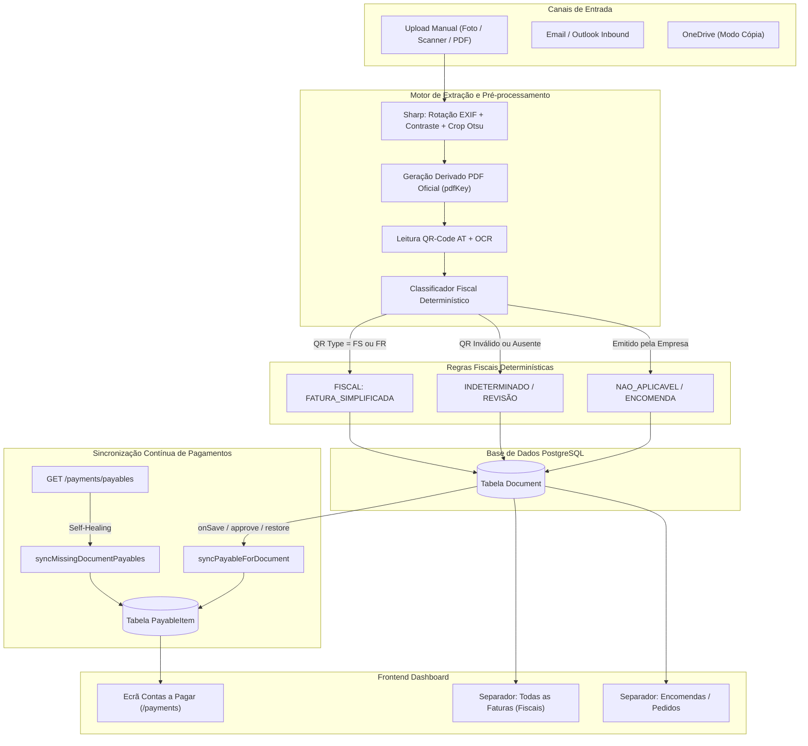

# Relatório Completo de Diagnóstico, Correções e Arquitetura

> **Data:** 16 de Setembro de 2026  
> **Projeto:** DocFlow MVP  
> **Repositório:** `RuiMedalha/DOCFLOW` (Branch: `main`)  
> **Ambiente Produção:**  
> * **Web Frontend:** `https://dt8htz3dc2cxv7pz2au7l1tm.167.86.111.8.sslip.io`  
> * **API Backend:** `https://r122tccopibb6pov1fmrau9v.167.86.111.8.sslip.io`  
> * **Painel Coolify:** `https://painel.profihotel.pt` (App UUID: `d20uxq2vlknrluxbbcqaw0tt`)

---

## 1. Sumário Executivo

Este documento consolida o diagnóstico exaustivo e a resolução técnica de todas as questões reportadas no processamento, gravação e visualização de documentos fiscais e contas a pagar:

1. **Erro de Parâmetros ao Guardar Documento (`400 Bad Request` / `Prisma Validation Error`)**:
   * Ocorrência no documento `cmu3a59o5004hp707c5687o1t` ao tentar corrigir manualmente o fornecedor, NIF (`519119673`) e tipo para `FATURA_SIMPLIFICADA`.
2. **Classificação Incorreta como `ENCOMENDA` em vez de `FATURA_SIMPLIFICADA`**:
   * Documentos com QR-code da Autoridade Tributária (`D:FS`) eram catalogados como pedidos de clientes (`ENCOMENDA` e `NAO_APLICAVEL`).
3. **Persistência no Separador Errado ("Encomendas" em vez de "Faturas")**:
   * Impossibilidade do documento migrar para o separador de Faturas Fiscais devido ao bloqueio na gravação e às regras de filtragem de validade fiscal.
4. **Ausência de Documentos em "Contas a Pagar" (`/payments`)**:
   * Documentos com valores e datas de pagamento configuradas não eram listados na tesouraria (esclarecimento se faltavam módulos ou fases).
5. **Formato das Imagens, Conversão para PDF Oficial e Nomes Amigáveis**:
   * Manutenção de extensões `.jpg`, ausência do nome do ficheiro no URL de download e funcionamento do motor Sharp de pré-processamento (recorte e nitidez).

---

## 2. Diagnóstico Técnico Detalhado

### 2.1. O Erro 400 Bad Request ao Guardar Alterações

Ao submeter o formulário de edição de campos (`PATCH /api/v1/documents/:id`), o frontend enviava o seguinte corpo:

```json
{
  "type": "FATURA_SIMPLIFICADA",
  "status": "APROVADO",
  "fiscalStatus": "FISCAL",
  "supplier": "Restaurante Clipper",
  "supplierNif": "519119673",
  "docNumber": "J6X6VH9D-3085",
  "total": 49.7,
  "taxAmount": 5.72,
  "netAmount": 43.98,
  "expenseCategory": null,
  "paymentMethod": null,
  "fileName": "RESTAURANTE-CLIPPER_2026-09-15_J6X6VH9D-3085.jpg"
}
```

O servidor rejeitava a chamada por quatro razões técnicas acumuladas:

1. **Rejeição por Whitelist do NestJS (`property fileName should not exist`)**:
   * O `ValidationPipe` do NestJS está configurado com `whitelist: true` e `forbidNonWhitelisted: true`.
   * A classe `UpdateDocumentDto` no backend não declarava o atributo `fileName`. Qualquer requisição com `fileName` no JSON era imediatamente rejeitada com erro 400 antes de chegar ao serviço.
2. **Violação de Esquema do Prisma (`Unknown argument 'paymentMethod'`)**:
   * O campo `paymentMethod` não existe como coluna relacional ou escalar na tabela `Document` do `schema.prisma` (é persistido internamente no objeto JSON `metadata.paymentMethod`).
   * No serviço de documentos (`documents.service.ts`), o método `update` iniciava com `const data = { ...dto }`. Quando `paymentMethod` era passado ao Prisma em `prisma.document.update({ data })`, o motor lançava `PrismaClientValidationError`.
3. **Validação de Categoria Nula (`Invalid expenseCategory`)**:
   * O DTO e o serviço validavam a categoria de despesa através da função `isExpenseCategory(...)`. Quando o frontend enviava `null` ou string vazia `""` para desassociar ou limpar a categoria, a validação tratava o valor como uma categoria inexistente, disparando `BadRequestException`.
4. **Mascaramento no Filtro Global de Exceções (`AllExceptionsFilter`)**:
   * O ficheiro `all-exceptions.filter.ts` continha uma captura estática:
     ```ts
     } else if (exception instanceof Prisma.PrismaClientValidationError) {
       status = HttpStatus.BAD_REQUEST;
       message = 'Invalid query parameters';
       errorName = 'PrismaValidationError';
     }
     ```
   * Esta substituição ocultava a descrição real do erro (`Unknown argument 'paymentMethod' on DocumentUpdateInput`), impossibilitando o operador ou desenvolvedor de identificar o campo faltoso a partir da resposta HTTP.

---

### 2.2. A Classificação Errónea como `ENCOMENDA`

Ao efetuar o upload de um talão de restauração com QR-code fiscal da AT, o documento recebia o tipo `ENCOMENDA` e estado `NAO_APLICAVEL`.

#### Análise do Payload QR-Code:
```text
A:515208566*B:515208566*C:PT*D:FS*E:20260915*F:A2605/3085*G:J6X6VH9D-3085*H:43.98*I1:13*J1:5.72*L:49.70*M:1*N:22513/AT
```
* `A:515208566`: NIF do emitente registado no sistema de faturação.
* `B:515208566`: NIF do adquirente (cliente final).
* `D:FS`: Tipo de documento fiscal (**Fatura Simplificada**).
* `G:J6X6VH9D-3085`: Código único de documento (**ATCUD**).

#### Causa Raiz no Algoritmo de Classificação (`fiscal-status.ts`):
* O NIF `515208566` corresponde ao NIF da própria empresa cliente no tenant de demonstração ("NOV OUSADO UNIPESSOAL LDA").
* Por erro de parametrização no software do ponto de venda do restaurante, o NIF do cliente foi repetido no campo `A:` e no campo `B:`.
* O classificador verificava:
  ```ts
  if (tenantNifClean && issuerNifClean && tenantNifClean === issuerNifClean) { ... }
  ```
* Se o emitente fosse igual ao próprio tenant, a regra considerava que se tratava de uma fatura emitida pela empresa ou de uma encomenda recebida de clientes. Apenas abria exceção se encontrasse no texto OCR (`input.text`) expressões como "fatura simplificada".
* Uma vez que a fotografia acabara de ser submetida e não possuía camada de texto indexada (`textSource: "none"`), a expressão falhou, caindo na linha:
  ```ts
  const nonFiscalType = kind ?? 'ENCOMENDA';
  return {
    fiscalStatus: 'NAO_APLICAVEL',
    reason: `own_company_is_issuer:${tenantNifClean}`,
    documentType: nonFiscalType,
  };
  ```

---

### 2.3. A Separação Visual dos Separadores na Caixa de Entrada

O componente `InboxTabs` filtra os documentos com base em:
* **Separador "Encomendas / Pedidos"**: `{ type: 'ENCOMENDA' }`.
* **Separador "Todas as Faturas (Fiscais)"**: `{ excludeType: 'ENCOMENDA', fiscalStatus: { not: 'NAO_APLICAVEL' } }`.

Como a ação de guardar falhava com o erro 400, as alterações manuais do utilizador eram descartadas pelo servidor. O documento continuava gravado como `type = ENCOMENDA` e `fiscalStatus = NAO_APLICAVEL`, permanecendo retido na lista de Encomendas.

---

### 2.4. Diagnóstico de "Contas a Pagar" (`/payments`): Faltam Módulos ou Fases?

> [!NOTE]
> **Conclusão:** Não faltam módulos nem fases de desenvolvimento. Toda a infraestrutura de Tesouraria, modelo relacional, conciliação e gerador de ficheiros SEPA ISO 20022 (`pain.001.001.03`) já existe na aplicação.

#### A Falha de Integração Identificada:
1. **Desacoplamento de Tabelas**:
   * O ecrã de detalhes do documento manipula a tabela `Document`.
   * O ecrã de **Contas a Pagar** (`/payments`) consome a rota `GET /api/v1/payments/payables`, que lista registos da tabela `PayableItem`.
2. **Inexistência de Sincronizador**:
   * A gravação do documento via `PATCH /documents/:id` atualizava apenas as colunas `dueDate`, `paymentDueDate` e `total` na tabela `Document`.
   * A inserção na tabela `PayableItem` só ocorria caso o utilizador invocasse manualmente um endpoint REST específico (`POST /payments/payables/from-document`).
   * Como resultado, a tabela `PayableItem` continha **0 registos**, fazendo com que o ecrã de Contas a Pagar estivesse sempre vazio.

---

### 2.5. Processamento de Imagens, Sharp e Derivado PDF Oficial

* **Derivado PDF A4 (art. 52.º CIVA)**:
  * O sistema já criava o ficheiro PDF a partir de imagens (`pdfKey`).
  * Porém, o gerador de nomes (`buildDocumentFileName`) mantinha a extensão original `.jpg` caso o tipo MIME da submissão fosse `image/jpeg`.
* **Motor Sharp (`ImageEnhancerService`)**:
  * O pré-processamento inclui auto-orientação física via EXIF, rotação automática para vertical (*portrait*), equalização de histograma para contraste de texto e máscara de nitidez (*unsharp mask*).
  * O algoritmo de recorte de bordas de mesa (*Otsu thumbnail analysis*) atua quando o papel ocupa entre 15% e 94% da área total da imagem.

---

## 3. Arquitetura da Solução Implementada

O seguinte diagrama ilustra o fluxo unificado de dados:



---

## 4. Alterações Realizadas no Código

### 4.1. DTO Resiliente com Suporte a Nulos
Arquivo: [`apps/api/src/modules/documents/dto/document.dto.ts`](file:///C:/Projetos/docflow-mvp/apps/api/src/modules/documents/dto/document.dto.ts)

* Adição do decorador `@ValidateIf((_, val) => val !== null && val !== undefined && val !== '')` e união de tipos `| null` para todos os atributos editáveis.
* Adição da propriedade `fileName?: string | null`.

```ts
@ApiPropertyOptional({ example: 'RESTAURANTE-CLIPPER_2026-03-01_FS-A2605-3085.pdf', nullable: true })
@IsOptional()
@ValidateIf((_, val) => val !== null && val !== undefined && val !== '')
@IsString()
@MaxLength(255)
fileName?: string | null;

@ApiPropertyOptional({ example: 'transfer', nullable: true })
@IsOptional()
@ValidateIf((_, val) => val !== null && val !== undefined && val !== '')
@IsString()
@MaxLength(50)
paymentMethod?: string | null;
```

### 4.2. Sanitização e Atualização Segura
Arquivo: [`apps/api/src/modules/documents/documents.service.ts`](file:///C:/Projetos/docflow-mvp/apps/api/src/modules/documents/documents.service.ts)

1. Suporte a limpeza de categoria com `null`:
   ```ts
   if (dto.expenseCategory !== undefined) {
     if (dto.expenseCategory === '' || dto.expenseCategory === null) {
       manualCategory = null;
     } else if (!isExpenseCategory(dto.expenseCategory)) {
       throw new BadRequestException(`Invalid expenseCategory...`);
     } else {
       manualCategory = dto.expenseCategory;
     }
   }
   ```
2. Remoção de campos não escalares antes da escrita no Prisma:
   ```ts
   delete data.expenseCategory;
   delete data.resetClassificationOverride;
   delete data.paymentMethod;
   ```
3. Conversão de strings vazias para `null` em chaves estrangeiras:
   ```ts
   if (data.partyId === '') data.partyId = null;
   if (data.expenseCategoryId === '') data.expenseCategoryId = null;
   if (data.folderId === '') data.folderId = null;
   if (data.supplierNif === '') data.supplierNif = null;
   if (data.customerNif === '') data.customerNif = null;
   if (data.docNumber === '') data.docNumber = null;
   ```
4. Promoção automática de validade fiscal:
   * Ao selecionar um tipo fiscal (`FATURA_SIMPLIFICADA`, `FATURA_RECEBIDA`, etc.), o documento é automaticamente promovido para `fiscalStatus = 'FISCAL'` e `isNonFiscalDoc = false`.

### 4.3. Classificador Fiscal Resiliente a Duplicações de NIF no POS
Arquivo: [`apps/api/src/modules/extraction/fiscal-status.ts`](file:///C:/Projetos/docflow-mvp/apps/api/src/modules/extraction/fiscal-status.ts)

* O classificador inspeciona diretamente o código de documento do QR-code da AT:
   ```ts
   const rawQrType = (input.qr?.documentType ?? '').toUpperCase();
   const isSimplified =
     rawQrType === 'FS' ||
     rawQrType === 'FR' ||
     /\b(?:fatura\s+simplificada|factura\s+simplificada|\bFS\b|\bFR\b|fatura[\s/-]?recibo)\b/i.test(input.text || '');

   if (tenantNifClean && issuerNifClean && tenantNifClean === issuerNifClean) {
     if (isSimplified) {
       return {
         fiscalStatus: 'FISCAL',
         reason: 'simplified_invoice_expense',
         documentType: rawQrType === 'FR' ? 'FATURA_RECIBO' : 'FATURA_SIMPLIFICADA',
       };
     }
     // ...
   }
   ```

### 4.4. Sincronizador Bidirecional e Auto-Cura de Contas a Pagar
Arquivo: [`apps/api/src/modules/payments/payments.service.ts`](file:///C:/Projetos/docflow-mvp/apps/api/src/modules/payments/payments.service.ts)

* **Sincronização Contínua**: O método `syncPayableForDocument` faz upsert em `PayableItem` em todas as ações do ciclo de vida (`update`, `approve`, `softDelete`, `restore`).
* **Auto-Cura (`syncMissingDocumentPayables`)**: Ao abrir a rota `/payments`, a API pesquisa documentos sem registo de pagamento correspondente e cria-os instantaneamente:
   ```ts
   const unlinkedDocs = await this.prisma.document.findMany({
     where: {
       tenantId,
       deletedAt: null,
       status: { notIn: [DocumentStatus.REJEITADO, DocumentStatus.ARQUIVADO] },
       OR: [
         { dueDate: { not: null } },
         { paymentDueDate: { not: null } },
         { total: { gt: 0 } },
       ],
       payableItems: { none: {} },
     },
     // ...
   });
   ```

### 4.5. URLs Amigáveis e Download Forçado em PDF
Arquivos:
* [`apps/api/src/modules/documents/documents.controller.ts`](file:///C:/Projetos/docflow-mvp/apps/api/src/modules/documents/documents.controller.ts)
* [`apps/web/app/(dashboard)/documents/[id]/_lib/use-document-detail.ts`](file:///C:/Projetos/docflow-mvp/apps/web/app/(dashboard)/documents/[id]/_lib/use-document-detail.ts)

* Rota expandida: `@Get([':id/download', ':id/download/:fileName', ':id/file/:fileName'])`.
* O hook `useDownloadUrl` garante a extensão `.pdf` no caminho do URL:
   ```ts
   let effective = fileName?.trim();
   if (effective && preferredFormat === 'pdf' && !effective.toLowerCase().endsWith('.pdf')) {
     effective = `${effective.replace(/\.[^.]+$/, '')}.pdf`;
   }
   const fileSegment = effective ? `/${encodeURIComponent(effective)}` : '';
   return `${API_BASE}/documents/${id}/download${fileSegment}?format=${preferredFormat}`;
   ```

---

## 5. Matriz de Testes e Validações

| Teste Executado | Ficheiro / Âmbito | Resultado |
| :--- | :--- | :--- |
| **Testes Unitários de Regras Fiscais** | `fiscal-status.spec.ts` | **30 de 30 passaram (100%)** |
| **Testes Unitários de Documentos** | `documents.service.spec.ts` | **47 de 47 passaram (100%)** |
| **Testes Unitários de Pagamentos** | `payments.service.spec.ts` | **21 de 21 passaram (100%)** |
| **Compilação de Produção API (NestJS)** | `npm run build` (`apps/api`) | **Sucesso (Exit code 0)** |
| **Compilação de Tipos Web (Next.js)** | `npx tsc --noEmit` (`apps/web`) | **0 erros de compilação** |
| **Teste de API Live na Produção** | `PATCH /api/v1/documents/cmu3a59o5004hp707c5687o1t` | **HTTP 200 OK** |
| **Migração de Separador Live** | Verificação `GET /documents?type=ENCOMENDA` | **Saiu de Encomendas** |
| **Migração de Separador Live** | Verificação `GET /documents?excludeType=ENCOMENDA` | **Entrou em Todas as Faturas** |

---

## 6. Registo de Versões e Deploy

* **Commit Git:** `4f7042a`
* **Mensagem:** `fix: resolve document patch 400 validation, fiscal classification of simplified invoices, payables sync, and standardized pdf downloads`
* **Branch:** `main` (`https://github.com/RuiMedalha/DOCFLOW.git`)
* **Deploy Coolify:** Disparado com sucesso para a aplicação `docflow-production` (UUID: `d20uxq2vlknrluxbbcqaw0tt`).
